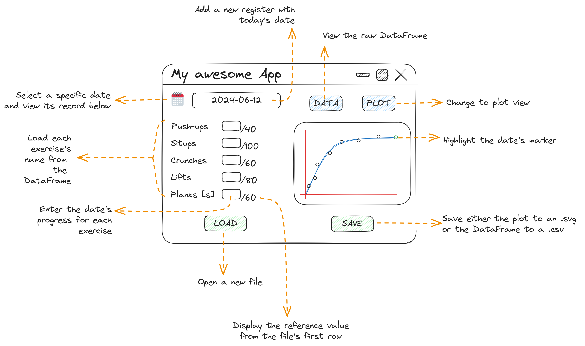

# Why Lift? 💪🤔💭

This project seeks to solve another specific problem of mine: tracking my fitness routine. I just want to see my progress, log the repetitions made for every exercise type in a spreadsheet and see the plot.

> [!note] Some background
> 
> I started tracking how much I progressed after recovering from a surgery, hence the *reference* date and the *post-op-1* table name. As of today (June 12, 2024) I still have another surgery scheduled.

The idea of using a SQL database comes from an attempt to future-proof this app, and allow to use it in stand-alone mode (i.e. without the need of a spreadsheet to log my progress.)

## Objectives:
- [x] Have Python read either a `.sql` or `.xlsx` database with the exercise type and number of repetitions made.
- [x] Show a graph the percentage of progress made with respect to a "standard".
- [ ] Develop a usable GUI. Include the following sections:
  - [ ] **Session**: to log that date's progress. Ideally this would be a split view with the plot, updating live to the right.
  - [ ] **Data**: with the actual DataFrame of historical data.

The goal is to have something like this:

